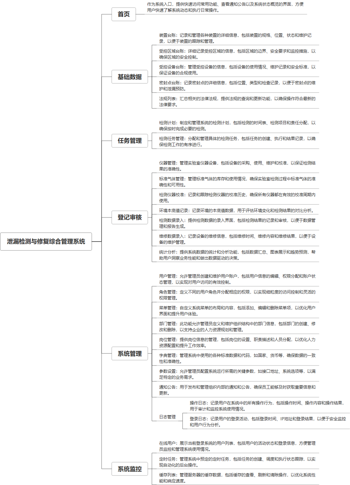

 

    
 

公司拥有上百套具有自主知识产权的软件系统，详情请查看码云首页或公司官网

 
<h1>泄漏检测与修复综合管理系统</h1>

<a href="https://www.haishi.net.cn/">公司官网</a> ｜ <a href="https://www.haishi.net.cn/">在线体验</a>

 

## 系统介绍

泄漏检测与修复综合管理系统是一款专业的设备管理工具，它集成了泄漏检测、设备管理、审计记录、任务流程和统计分析等功能。系统支持对装置、受控区域、受控设备、密封点等信息的查询、新增、修改、删除和导出，同时提供检测计划、检测任务、维修任务的全流程管理。此外，系统还涵盖了法规列表、环境本底值记录、仪器维护记录的维护，以及检测数据录入和维修数据录入的审批流程，确保泄漏检测与修复工作的规范性和数据准确性，为企业提供高效的设备管理决策支持。
泄漏检测与修复综合管理系统是一款专业的设备管理工具，它集成了泄漏检测、设备管理、审计记录、任务流程和统计分析等功能。系统支持对装置、受控区域、受控设备、密封点等信息的查询、新增、修改、删除和导出，同时提供检测计划、检测任务、维修任务的全流程管理。此外，系统还涵盖了法规列表、环境本底值记录、仪器维护记录的维护，以及检测数据录入和维修数据录入的审批流程，确保泄漏检测与修复工作的规范性和数据准确性，为企业提供高效的设备管理决策支持。
---
本项目名称为泄漏检测与修复综合管理系统，旨在帮助企业进行泄漏检测和修复工作，实现全流程的数字化管理。该系统适用于存在泄漏风险的企业，例如化工、石油、天然气等行业，它主要包括基础数据管理、任务管理、登记审核、统计分析、系统管理等模块。
本项目主要面向企业内部用户，例如：
- 管理员：可以进行系统配置、用户管理、数据分析等操作。
- 检测人员：可以使用仪器管理、标准气体管理、检测数据录入等功能进行检测工作。
- 维修人员：可以使用维修任务管理、维修数据录入等功能进行维修工作。
---
                

## 系统功能介绍

### 系统包含终端说明

管理端（WEB）

| 序号 | 模块 | 模块说明 |
| --- | --- | --- |
| 1 | GC-LDAR-HGC-SERVER | 服务端 |
| 2 | GC-LDAR-HGC-MANAGE | 管理端 |

### 系统功能结构

### 系统功能说明

- 基础数据管理：对装置、区域、设备、密封点等基础信息进行管理，为泄漏检测和修复工作提供数据支撑。
- 任务管理：制定检测计划，下发检测任务和维修任务，跟踪任务执行情况。
- 登记审核：对检测仪器、标准气体、检测数据、维修数据进行登记和审核，确保数据的准确性和可靠性。
- 统计分析：对泄漏检测和修复数据进行统计分析，为决策提供依据。

## 系统主要界面

## 系统技术说明

### 代码模块说明

| 序号 | 目录 | 目录说明 |
| --- | --- | --- |
| 1 | GC-LDAR-HGC-SERVER/.idea | -- |
| 2 | GC-LDAR-HGC-SERVER/src | -- |

### 系统技术选型

#### 开发语言/框架

JAVA（JDK1.8）

#### 服务中间件

Nginx
Tomcat

#### 数据库

MySQL（5.7+）

#### 其他说明

无

## 系统演示/商用

请扫码添加客服微信获取演示地址和系统详细资料。

如果您想基于泄漏检测与修复综合管理系统进行商业化交付或定制开发服务，我们提供有偿的技术服务支持，合作模式不限，欢迎沟通！

公司官网地址： <a href="https://www.haishi.net.cn/">https://www.haishi.net.cn</a>

联系客服获取专业回答。

## 使用须知

1、 本项目商用必须获得版权所有者的授权。

2、 未经允许本项目代码不允许二次出售。

